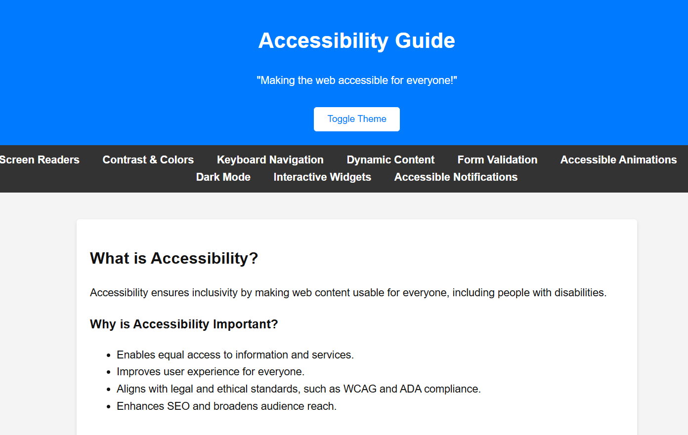

# Accessibility Guide

[](https://github.com/arzucaner/web-accessibility-guide/stargazers)
[](https://github.com/arzucaner/web-accessibility-guide/network/members)
[](https://opensource.org/licenses/MIT)
[](https://github.com/arzucaner/web-accessibility-guide/issues)
[](https://github.com/arzucaner/web-accessibility-guide/commits/main)
[](https://github.com/arzucaner/web-accessibility-guide/graphs/contributors)

Questions or ideas? [Start a Discussion](https://github.com/arzucaner/web-accessibility-guide/discussions).

"Making the web accessible for everyone!"



---

## Description

The **Accessibility Guide** is an educational project designed to showcase essential web accessibility features. It demonstrates how to make websites usable for everyone, including individuals with disabilities, by integrating accessibility principles such as semantic HTML, ARIA attributes, contrast management, keyboard navigation, and more.

This guide is a comprehensive resource for developers looking to implement accessibility best practices in their projects.

---

## Features

- **Accessibility Overview**: Explains the importance of accessibility and its benefits.
- **Screen Readers**: Demonstrates how to optimize websites for screen readers using ARIA roles and labels.
- **Contrast & Colors**: Provides high-contrast mode and tools to test contrast ratios.
- **Keyboard Navigation**: Ensures navigation is fully accessible via the keyboard, with focus management examples.
- **Dynamic Content**: Uses ARIA live regions to notify screen readers of content updates.
- **Form Validation**: Includes real-time form validation with accessible error messages.
- **Accessible Animations**: Implements motion reduction settings for users sensitive to animations.

---

## Live Demo

You can view the live demo of this project here:
[Accessibility Guide](https://arzucaner.github.io/web-accessibility-guide/)

---

## How to Use

To get started with this project:

1. Clone this repository to your local machine:

   ```bash
   git clone https://github.com/arzucaner/web-accessibility-guide.git
   ```
2. Navigate to the project directory:

```
cd web-accessibility-guide
```

3. Open the `index.html` file in your browser to explore the guide.

---

## Contribution Guidelines

We welcome contributions from the community! Here's how you can get involved:

1. **Report Issues** : If you notice any bugs or have suggestions for improvement, please [open an issue](https://github.com/arzucaner/web-accessibility-guide/issues).
2. **Fork the Repository** : Create your own copy of this repository by clicking the "Fork" button.
3. **Clone Your Fork** :

```
git clone https://github.com/arzucaner/web-accessibility-guide.git
```

1. **Create a Feature Branch** :

```
git checkout -b feature/
```

1. **Make Your Changes** :

* Ensure your changes align with accessibility best practices.
* Test your changes thoroughly to confirm they work as intended.

1. **Commit Your Changes** :

```
git add .
git commit -m "feat: Add 
```

1. **Push Your Changes** :

```
git push origin feature/
```

1. **Submit a Pull Request** :

* Navigate to the original repository on GitHub.
* Go to the "Pull Requests" tab and click "New Pull Request."
* Provide a clear description of your changes and submit the pull request.

---

## Standards baseline

This guide follows **WCAG 2.2 (Level AA)** as its primary standard, with **WAI-ARIA 1.2** for rich-widget patterns. See **[docs/standards.md](docs/standards.md)** for the full standards baseline, ARIA guidance, evaluation methodology, and reference links.

---

## Quick checklist

A one-page, copy-and-paste accessibility checklist for developers and QA — covers keyboard, forms, headings, images, contrast, zoom, motion, and live regions. See **[docs/quick-checklist.md](docs/quick-checklist.md)**.

---

## Troubleshooting

Running into a specific accessibility issue? See **[docs/common-bugs.md](docs/common-bugs.md)** — 12 common bugs with symptoms, fixes, and code examples.

---

## UI patterns

Detailed, copy-ready patterns with HTML examples, screen reader notes, and quick tests:

- **[Navigation & Landmarks](docs/patterns/navigation-landmarks.md)** — skip links, landmark structure, labelling, keyboard flow
- **[Accessible Tables](docs/patterns/tables.md)** — captions, headers/scope, responsive approaches, sorting
- **[Alerts, Toasts & Live Regions](docs/patterns/alerts-toasts-live-regions.md)** — `role="alert"` vs `aria-live`, toast patterns, async updates

---

## Framework notes

Accessibility patterns for specific frameworks and libraries:

- **[React & Next.js](docs/frameworks/react-next.md)** — `useId`, icon buttons, SPA focus management, headless component pitfalls, testing with jsx-a11y and axe

---

## Contribution Tips

* Follow [WCAG 2.2](https://www.w3.org/TR/WCAG22/) — our accessibility baseline. See [docs/standards.md](docs/standards.md) for details.
* Test your contributions with screen readers or accessibility tools.
* Use the [Conventional Commits](https://www.conventionalcommits.org/) format for your commit messages.

---

## License

This project is licensed under the MIT License.

---

## 👥 Contributors

Thanks goes to these wonderful people ([emoji key](https://allcontributors.org/docs/en/emoji-key))!

<!-- ALL-CONTRIBUTORS-LIST:START - Do not remove or modify this section -->
<!-- ALL-CONTRIBUTORS-LIST:END -->

This project follows the [all-contributors](https://github.com/all-contributors/all-contributors) specification. Contributions of any kind welcome!

---

## Acknowledgments

This project aims to raise awareness about web accessibility and provide developers with practical examples of how to create more inclusive websites.

If you found this guide helpful and want to support my work, feel free to buy me a coffee:
[](https://buymeacoffee.com/arzuguney?status=1)

I appreciate your support in making the web a better place for everyone. Thank you for contributing!
